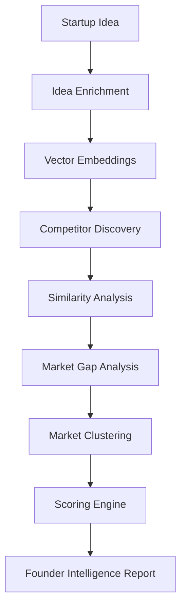

# 🚀 Saasify

### AI-Powered Startup Intelligence Platform

Saasify helps founders evaluate startup ideas before investing months into building them.

By combining AI, semantic search, vector retrieval, and market intelligence, Saasify transforms a simple startup idea into an actionable founder report.

---

## ✨ Features

* 🔍 Competitor Discovery
* 📊 Competition & Opportunity Analysis
* 🎯 Differentiation Scoring
* 💡 Market Gap Detection
* ⚠️ Risk Assessment
* 🧠 Founder Recommendations
* 📈 Market Intelligence Insights

---

## 🏗️ How It Works

---

## 🤖 AI & ML Pipeline

### Idea Enrichment

Extracts:

* Industry
* Target Customer
* Business Model
* Pain Point
* Solution

### Competitor Discovery

Uses semantic retrieval and vector search to identify similar startups.

### Similarity Analysis

Measures overlap across:

* Customer Segment
* Problem Space
* Solution
* Market Category

### Market Gap Analysis

Identifies:

* Opportunities
* Missing Features
* Risks
* Threats

### Market Intelligence

Uses clustering models to understand market segments and competition density.

### Founder Recommendations

Generates:

* Positioning Suggestions
* Monetization Strategies
* Feature Recommendations
* Customer Acquisition Insights

---

## 🛠️ Tech Stack

### Frontend

* Next.js
* React
* TypeScript
* Tailwind CSS

### Backend

* FastAPI
* Python

### AI / Machine Learning

* Groq (Llama 3.3 70B)
* Sentence Transformers
* Qdrant Vector Database
* UMAP
* HDBSCAN

### Infrastructure

* Supabase
* Hugging Face Spaces

---

## 📊 Example Output

* Competition Score
* Differentiation Score
* Opportunity Score
* Competitive Landscape
* Market Gaps
* Risks & Threats
* Founder Recommendations

---

## 🎯 Vision

The goal of Saasify is simple:

Help founders make better decisions before they build.

Instead of generating more startup ideas, Saasify focuses on evaluating whether an idea is worth pursuing in the first place.

---

## 🔗 Live Demo

https://saasify-umber.vercel.app/
